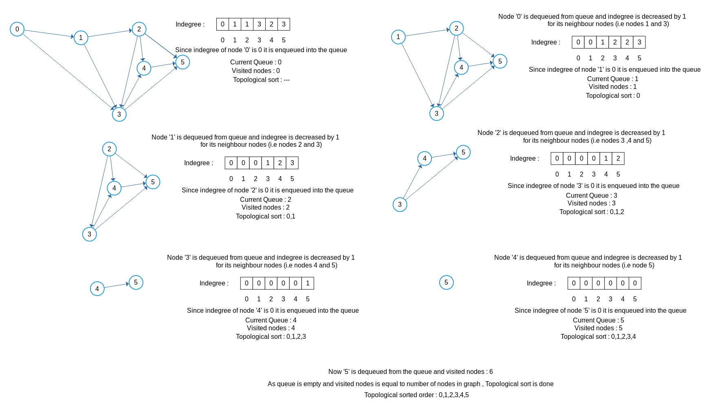

### Video Demo for Kahn's Algorithm
<iframe src="https://www.youtube.com/embed/Y5FQYaLFjuE" frameborder="0" allow="autoplay; encrypted-media" allowfullscreen></iframe>

### Algorithm

Steps involved in finding the topological ordering of a DAG:

  -  Step-1: Compute in-degree (number of incoming edges) for each of the vertex present in the DAG and initialize the count of visited nodes as 0.
  - Step-2: Pick all the vertices with in-degree as 0 and add them into a queue (Enqueue operation)
  -  Step-3: Remove a vertex from the queue (Dequeue operation) and then increment count of visited nodes by 1. Decrease in-degree by 1 for all its neighbouring nodes. If in-degree of a neighbouring node is reduced to zero, then add it to the queue.
  -  Step 4: Repeat Step 3 until the queue is empty.
   - Step 5: If count of visited nodes is not equal to the number of nodes in the graph, then the topological sort is not possible for the given graph.

### Step-wise Representation of Kahn's Algorithm

### What is indegree and how to find it?

**What is meant by indegree?**

It is simply the count of number of edges pointed towards the vertex from other vertices.

**How to find indegree?**

Traverse the array of edges and simply increase the counter of the destination node by 1.
Algorithm: 
for each node in Nodes 
  indegree[node] = 0; 
for each edge(src,dest) in Edges 
  indegree[dest]++; 
Video Demo for Kahn's

