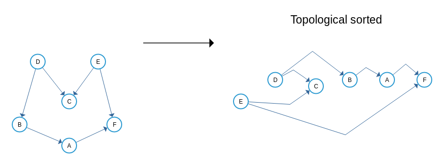

### What is Topological Sort?

Topological sorting of vertices of a Directed Acyclic Graph is an ordering of the vertices v1,v2,...,vn in such a way, that if there is an edge directed towards vertex vj from vertex v i, then vi comes before vj. There are multiple topological sortings possible for a graph. A topological ordering is possible if and only if the graph has no directed cycles, that is, if it is a directed acyclic graph (DAG).

### Example of Topological Sort

### Why topological sort only for DAG?

It is clear that a topological ordering is not possible if the graph has a cycle, since for two vertices v and w on the cycle, v precedes w and on contrary even w precedes v, so it is not meaningful to say which preceeds the other. So topological sorting can be achieved for only directed and acyclic graphs.

**A DAG 'G' has at least one vertex with in-degree 0 and one vertex with out-degree 0**.

**Proof**: A DAG does not contain a cycle which means that all paths will be of finite length. Now let S be the longest path from u(source) to v(destination). Since S is the longest path there can be with no incoming edge to u and no outgoing edge from v, if this situation had occurred then S would not have been the longest path => indegree(u) = 0 and outdegree(v) = 0

