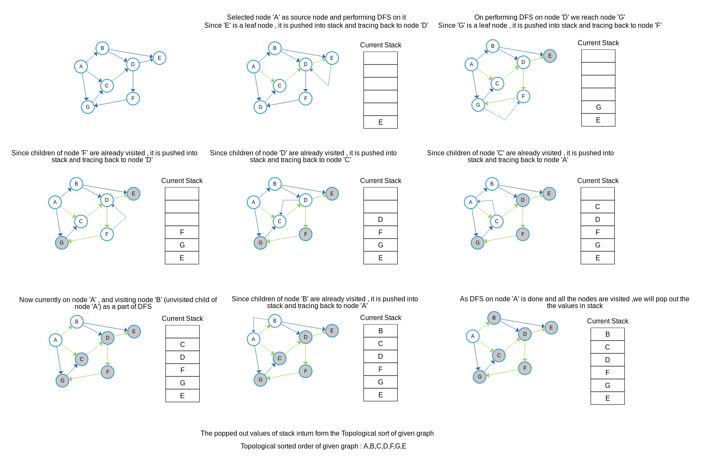

### Algorithm

We can modify DFS to find Topological Sorting of a graph. In DFS, we start from a vertex, we first print it and then recursively call DFS for its adjacent vertices. In topological sorting, we use a temporary stack. We don’t print the vertex immediately, we first recursively call topological sorting for all its adjacent vertices, then push it to a stack. Finally, print contents of stack. Note that a vertex is pushed to stack only when all of its adjacent vertices (and their adjacent vertices and so on) are already in stack.

### Step-wise Representation of finding topological sort through DFS

